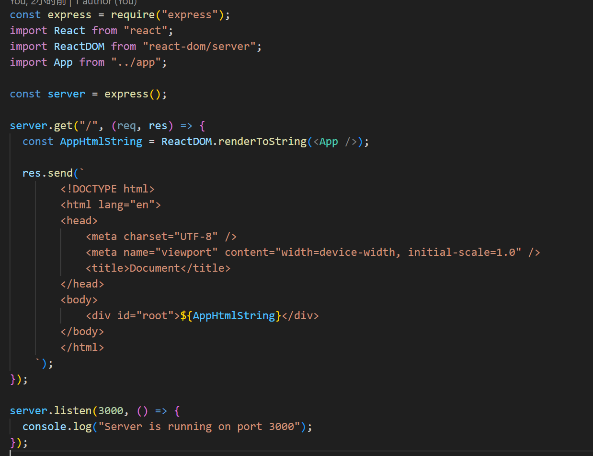
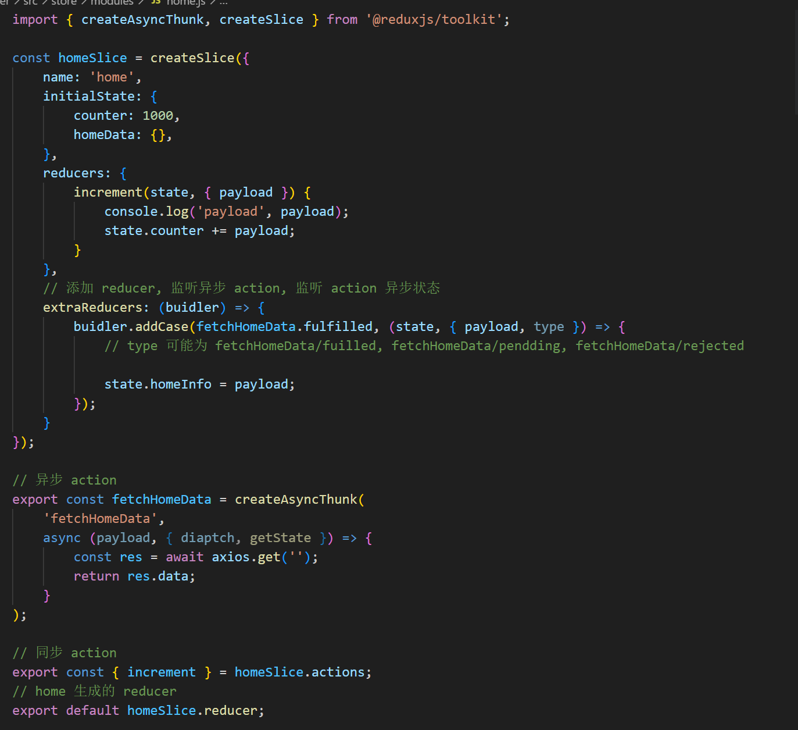
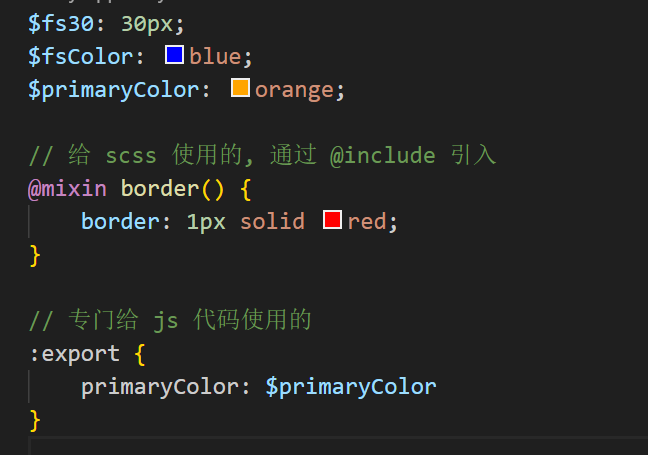
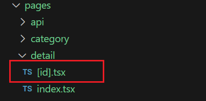

## React18 ssr

在 React 中创建 SSR 需要调用 ReactDOM.hydrateRoot() 而不是 ReactDOM.createRoot()

- createRoot: 创建一个 Root 接着调用 render 方法将 App 直接加载到页面上
- hydrateRoot: 创建 水合 Root，在激活的模式下渲染 App

服务端可用 ReactDOM.renderToString 来进行渲染。

```js
import React from "react";
import ReactDOM from "react-dom/client";
import App from "../index.jsx";

// 在客户端激活应用, 应用可以进行交互(这个过程称为 hydration 水合)
ReactDOM.hydrateRoot(document.getElementById("root"), <App />);
```

## 搭建简易 ssr

需要用到: ReactDOM.renderToString(<App />) 来进行渲染



### config.js

- 合并 config.js

```js
import baseConfig from "./base.config";
import { merge } from "webpack-merge";

module.exports = merge(baseConfig, {});
```

### 服务端根据链接返回渲染页面

- 先在 index.js 里引入 `import { StaticRouter } from 'react-router-dom/server';`

然后将该组件包裹 app

```js
ReactDOM.renderToString(
  <StaticRouter location={req.url}>
    <App />
  </StaticRouter>
);
```

- App.js 里引入 `import { Link, useRouters } from 'react-router-dom';`

然后使用

```js
<Link to="/">home</Link>
<Link to="/about">about</Link>

{/* 页面的占位 */}
{useRouters(routes)}
```

> > > 不同工具一些路由跳转的不同

- Vue 里使用 `<router-link to="">`
- Nuxt 里使用 `<NuxtLink to="">`
- React 里使用 `<Link to="">`
- Next 里使用 `<Link href="">`

### 集成 redux

`npm i react-redux @reduxjs/toolkit`

#### 认识 Redux Toolkit (RTK)

Redux Toolkit 是官方推荐的编写 Redux 逻辑的方法

以前在使用 redux 时, 通常会将 redux 代码拆分在多个模块, 每个模块需包含多个文件, 如 constants, action, reducer, index 等

然后使用 `combineReducers` 对多个模块合并, 这种代码组织方式过于繁琐和麻烦, 导致打码量过多, 也不利于后期管理

Redux Tookit 就是为了解决这个问题而生的.

#### Redux Toolkit 的核心 API

- configureStore: 包装 createStore 以提供简化的配置选项和良好的默认值. 可以自由组合 reducer; 可以添加其他 Reducer 中间件, redux-thunk 默认包含在内; 默认启用 Redux DevTools Extension

- createSlice: 接受切片名称, 初始状态和 reducer 函数的对象, 并且自动生成切片 reducer, 并带有响应的 actions.

- createAsyncThunk: 接受一个动作类型字符串和一个返回承诺的函数, 并生成一个 pending/fulfilled/rejected 基于该承诺分配 action 类型的 thunk. 简单理解就是专门用来创建异步 action

#### 同步/异步 action



## NextJS 初体验

支持 CSR, SSR, SSG, ISR 等渲染模式

### Next vs Nuxt

相同点：

- 利于搜索引擎优化，提高收评渲染速度
- 0 配置，开箱即用
- 支持目录结构即路由， 支持数据获取、TypeScript
- 服务端渲染、静态网站生成、客户端渲染等
- 需要 Nodejs 服务器，支持全栈开发

区别：

- Nextjs 使用的是 React 技术栈: React, webpack, express, node. 社区生态更友好
- Nuxt3 使用 vue 技术栈: Vue, webpack, vite, h3, nitro, node. 支持组件,组合式 API

### 项目搭建

npx create-next-app@latest --typescript

### 默认引入路径设置

tsconfig.json

```json
{
  "compilerOptions": {
    "baseUrl": ".",
    "paths": {
      "@/compontns/*": ["components/*"],
      "@/assets/*": ["assets/*"],
      "@/service/*": ["service/*"],
      "@/store/*": ["store/*"]
    }
  }
}
```

### 环境变量设置

.env 文件

```.env
NAME=localhost
PORT=3000
HOSTNAME=127.0.0.1
# 这些变量最终会注入到 process.env

NEXT_PUBLIC_HOSTNAME=test
```

**以 NEXT*PUBLIC* 开头的变量，在客户端和服务端都可以访问到**

.env.local 保存敏感变量 保存在本地 如私钥等

### 内置组件

- Head
  将新增的标签添加到页面的 head 标签中, 需要从 "next/head" 导入

方便我们做 seo 和 meta 信息, 添加外部的资源

- `import { Html, Head, Main, NextScript } from 'next/document'`

### 全局样式

#### sass 定义变量



sass 文件引用变量可以通过 `@use "" as *` 的方式引用

如果 js 组件想要导入 scss 文件, 那么 scss 文件必须以 module.scss 为后缀.

### 静态资源的引用

可以通过静态 url 引用.

css 里引用路径开头要加 `~/`

### 组件导航

Link 组件

replace 属性为 true 则会直接替换当前页面，而不会加入到历史记录中

```js
import Link from "next/link";

<div>
  <Link href={"/category"} as="路径别名, 浏览器地址栏显示这个别名" replace>
    <button>category</button>
  </Link>
  <Link href={{ pathname: "/profile", query: { test: "test" } }}>
    <button>profile</button>
  </Link>
  <Link href={"https://www.baidu.com"}>baidu</Link>
  <Component {...pageProps} />
</div>;
```

### 编程导航

Next13 除了可以通过 `<Link>` 组件导航, 也支持编程导航.

缺点是不利于 SEO.

我们可以从 next/router 中导入 useRouter 函数(或在 class 组件中用 withRouter), 调用该函数可以拿到 router 对象进行编程导航.

router 对象的方法:

- router.push(url, [,as, opts])
- router.replace(url, [,as, opts])
- router.back()
- router.events.on(name, func) 路由守卫, 监听路由(建议在 \_app.tsx 监听);

#### 动态路由

根据目录结构和文件的名称自动生成.

页面组件目录 或 页面组件文件都支持 [] 方括号语法 (方括号前后不能有字符串)
方括号里编写的字符串就是动态路由的参数

eg.

- pages/detail/[id].tsx => /detail/:id
- pages/detail/[role]/[id].tsx => /detail/:role/:id



动态路由也可以层层嵌套：/[role]/[id]

#### 404 page

- 方法 1： 捕获所有不匹配的路由

  - 通过在方括号内添加三个点, 如 [...slug].tsx 语法, 如在其他目录下的话仅作用于该目录以及子目录.
  - 该方法可以捕获所有不匹配的路由, 包括动态路由

- 方法 2： 手动创建 404 页面
  - 在 pages 目录下创建 404.ts

## Next 核心内容

### 中间件

Next.js 的中间件允许我们取拦截客户端发起的请求, 例如: API 请求, router 切换, 资源加载 和 站点图片等.

```js
import { NextRequest } from "next/server";

// 只在服务端运行, 拦截 API 请求, router 切换, 资源加载 和 站点图片等
export function middleware(req: NextRequest) {
  console.log("中间件", req.url);
}

// 中间件配置
export const config = {
  // 匹配器, 指定路径才会执行该中间件
  // matcher: ['/sys/:path*'] // 匹配 /sys/... 的路径
  matcher: ["/(?!_next/static)"], // 支持正则
};
```

#### 中间件的返回

- 返回 next()
- 返回 重定向
- 重写, 反向代理

```js
export function middleware(req: NextRequest) {
  console.log("中间件", req.url);

  // 返回 next();
  // return NextResponse.next();

  // 返回 重定向
  //   let token = req.cookies.get("token")?.value;

  //   if (!token && req.nextUrl.pathname !== "/login") {
  //     // 重定向到登录页
  //     return NextResponse.redirect(new URL("/login", req.nextUrl.origin));
  //   }

  // 路径重写, 相当于反向代理
  if (req.nextUrl.pathname === "/login") {
    // 当请求到 /login 时, 重写到其他路径
    return NextResponse.rewrite(
      new URL(req.nextUrl.pathname, "http://localehost.com:9000")
    );
  }
}
```

### 布局组件 Layout

Layout 布局是页面的包装器, 可以将多个页面的共性东西写到 Layout 布局中, 使用 props.children 属性来显示页面内容.

- 使用步骤:
  1. 在 components 目录下新建 layout.tsx 布局组件
  2. 接着在 \_app.tsx 中通过 <Layout> 组件包裹 <Compontent> 组件

布局组件可以层层嵌套.

### 嵌套路由

支持嵌套路由, 根据目录结构和文件的名称自动生成(但是只在 app 目录下), 但是 Next 生成的也是属于一级路由.

两种实现方案:

1. 使用 Layout 布局嵌套实现
2. 使用 Next.js 13, 新增 app 目录(beta 版本)

#### Next.js 13 app 目录结构

app 文件夹对应的页面路径.

app 目录里有 layout.tsx, head.tsx 和 page.tsx, 并且每个页面有 layout.tsx 和 page.tsx.

head.tsx 是页面的头部, 是公共组件, 每个页面都会包含该组件.

page.tsx 对应为一个页面, layout 为这个页面及子页面的公共的内容, 包裹 page.tsx 的文件.

### 生命周期

服务端会执行的生命周期:

- constructor
- UNSAFE_componentWillMount
- render
- function component 函数组件本身

## Next 编写后端接口

Next.js 提供了编写后端接口的功能（API Routes）, 编写接口可以在 pages/api 目录下编写.

在 pages/api 目录下的任何 API Routes 文件都会映射到以 /api/\* 前缀开头接口地址

比如: 编写一个 /api/user 接口

## 预渲染

默认情况下, Next.js 会在构建应用时预渲染所有页面, 为每一个页面生成 HTML 文件, 而不是客户端 JavaScript 来完成.

预渲染可以带来更好的性能和 SEO 效果.

当浏览器加载一个页面时, 页面依赖 JS 代码将会执行, 执行 JS 代码后会激活页面, 使页面具有交互性(水合).

### 两种形式的预渲染:

- 静态生成(推荐): HTML 在构建时(build)生成, 并在每次页面请求(request)时重用.
- 服务端渲染: 在每次页面请求时重新生成 HTML 页面

### SSG (静态站点生成) - 静态生成

如果一个页面使用了静态生成, 运行 next build 时将生成该页面对应的 HTML 文件, 然后此 HTML 文件将每个页面请求时被重用, 还可以被 CDN 缓存.

在 Next.js 中你可以选择生成 带有数据/不带有数据 的静态页面.

#### 需要获取数据的静态页面生成

当某些情况需要获取外部数据进行预渲染, 通常由两种情况:

1. 页面内容取决于外部数据: 使用 Next.js 提供的 getStaticProps 函数.

```js
import React from "react";

export default function Books(props) {
  const { children } = props;

  return (
    <div>
      <div>
        {books.map((book: any) => {
          return book;
        })}
      </div>
    </div>
  );
}

export async function getStaticProps(context: any) {
  const res = await fetchBooks();

  return {
    props: {
      books: res.data.books,
    },
  };
}
```

2. 页面 paths 路径取决于外部数据: 使用 Next.js 提供的 getStaticPaths 函数(通常还要同时用 getStaticProps)

```js
export const getStaticPaths: GetStaticPaths = async (ctx) => {
  const res = await fetchBooks(5);
  const ids = res.data.books.map((item: any) => {
    return {
      params: {
        id: item.id + "",
      },
    };
  });

  return {
    paths: ids || [],
    fallback: false, // 如果动态路由没有匹配上的，返回 404
  };
};

export async function getStaticProps(context: any) {
  console.log(context.params.id);

  const res = await fetchBooksDetail(content.params?.id);

  return {
    props: {
      book: res.data.book,
    },
  };
}
```

### SSR 服务端渲染

要对页面使用服务端渲染, 你需要 export 一个名为 getServerSideProps 的 async 函数.

服务器将在每次页面请求时调用此函数.

```js
// SSR 每次用户访问时执行
export const getServerSideProps: GetServerSideProps = async (context) => {
  console.log(context.query);
  const res = await fetchBooks(10);

  return {
    props: {
      books: res.data.books,
    },
  };
};
```

getServerSideProps 仅在服务端运行.

如果页面通过 URL 请求此页面时, getServerSideProps 在请求时运行, 并且此页面将使用返回的 props 进行预渲染.

当通过 Link 或 router 切换页面来请求此页面时, Next.js 向服务器发送 API 请求, 服务器端会运行 getServerSideProps.

什么时候使用 getServerSideProps:

- 当页面显示的数据必须请求时获取的
- 如果页面使用了 getServerSideProps 函数, 那么页面将在客户端请求时, 在服务器端渲染, 页面默认不会缓存.
- 如果不需要客户端每次请求时获取页面数据, 那么应该考虑在客户端动态渲染或者使用 getStaticProps 函数.

### 增量静态再生 ISR

在构建网站后创建或更新静态页面, 这种模式成为:增量静态再生(ISR)

```js
export async function getStaticProps(context: any) {
  const res = await fetchBooksDetail();

  return {
    props: {
      book: res.data.book,
        revalidate: 5, // 每隔5秒重新生成一次静态页面
    },
  };
}
```

## 集成 Redux

`npm i next-redux-wrapper --save`

- 可以避免在服务器端渲染页面时 store 的重置
- 该库可以将服务器端 redux 存的数据同步一份到客户端上
- 提供了 hydrate 调度操作. 当用户访问动态路由或后端渲染的页面时, 会执行 Hydration 来保持两端数据状态一致. 比如每次用户打开使用了 getStaticProps 或 getServerSideProps 函数生成的页面时, 将执行 Hydrate 操作

`npm i @reduxjs/toolkit react-redux --save`


